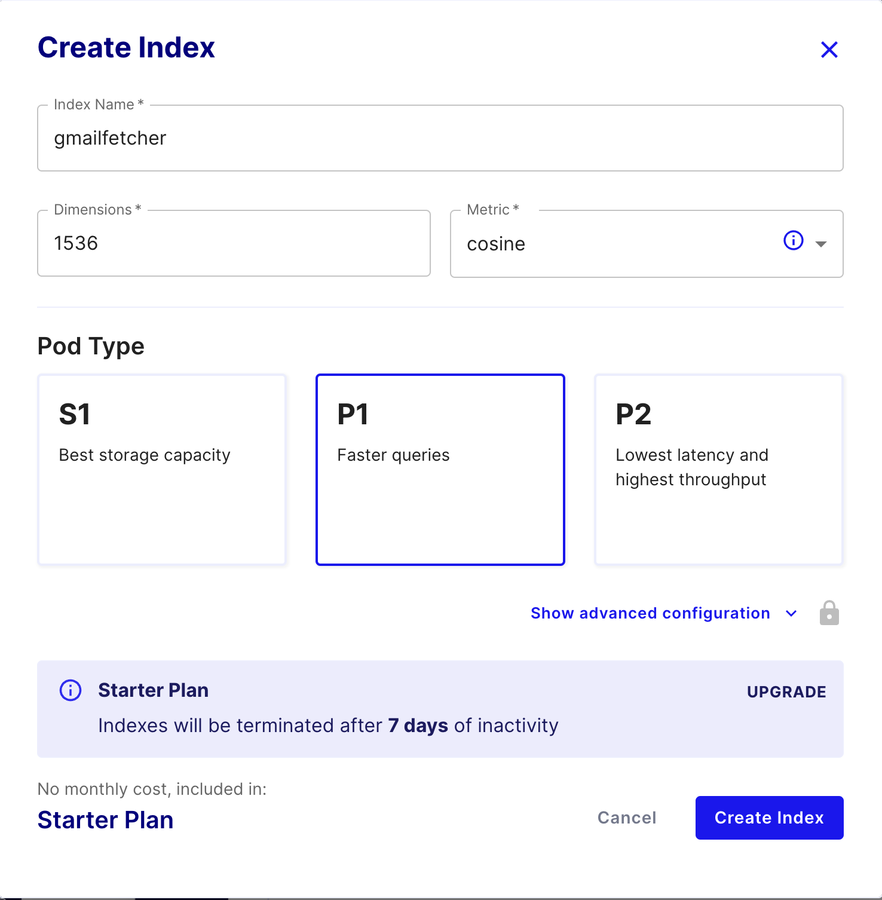
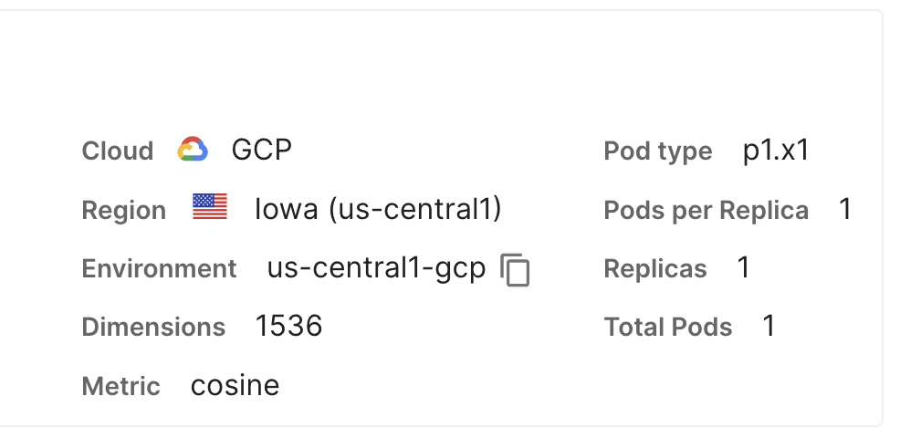

# Overview:
Have you ever vaguely remembered an email you wanted to retrieve from your inbox but just can't find it?  
Perhaps it was a long time ago, and you don't remember who it was from or what exactly it was about. 
Maybe you try typing in keywords and dates in the search bar, but you get dozens of search results instead of just one. 

This application can retrieve your emails instantaneously by using vague details or descriptions. 
In essence, you no longer need to search for emails using a matching string or a specific date. 
You only need to vaguely describe the email you're thinking about, and this application will find the email you are closely describing. 

When the email is found, this application will return the exact email subject and date of the email you're looking for, 
 along with some information about the email.

How does this work? This tool stores all of your Gmail emails in Pinecone, a vector database, with the assistance of LangChain + OpenAI embeddings. 
Upon execution of a search, Pinecone DB will return multiple documents that closely match the email you're looking for using semantic search. 

LangChain allows us to "chain" different application components together, such as Pinecone and OpenAI, in a sequential manner. 
What's also useful about LangChain is that it allows us to parse emails into smaller chunks of data to efficiently store them in the database. 

Technologies: Gmail API/Oauth, Pinecone, OpenAI API, Langchain, and Streamlit

### Starting Interface:

### Example of semantic search (using meaning rather than matching words to search):

# Getting started:
1. Create a Google developer account, Pinecone account, and OpenAI account.

2. Provide the following credentials as environment variables 
  GOOGLE_APPLICATION_CREDENTIALS = *your Google developer account key* 
  OPENAI_API_KEY = *key* 
  PINECONE_API_KEY = *key* 
  PINECONE_API_ENV = *key* 
  PINECONE_INSTANCE_NAME = *instance name*

  For this, you must create a Pinecone DB instance. 
  The instance should be created as shown below (dimensions MUST be 1536):

Grab the PINECONE_API_ENV from "Environment" as seen below:

3. Using your Google developer account, assign your desired Gmail account as an eligible user for this application in beta mode. 
  If you don't do this, the application won't be able to read your emails since this is a highly-privileged task. 
  I recommend you create a new Gmail account for this application and use mock data to ensure you 
  don't leak sensitive email information to Pinecone or OpenAI.

4. Create a credentials.json file like this below to allow Google Oauth/Gmail API to work.

  {
    "installed": {
      "client_id": "*key*.apps.googleusercontent.com",
      "project_id": "*project name",
      "auth_uri": "https://accounts.google.com/o/oauth2/auth",
      "token_uri": "https://oauth2.googleapis.com/token",
      "auth_provider_x509_cert_url": "https://www.googleapis.com/oauth2/v1/certs",
      "client_secret": "*client secret*",
      "redirect_uris": [
        "http://localhost"
      ]
    }
  }

# Running the Application:
1. Run the app by running "streamlit run main.py" in the command line while in the application folder.

2. Click "Authenticate and Extract" to log into your email account. Once authenticated, the app 
  will then begin reading ALL of your emails into the Pinecone Database. This operation may take 
  some time if you have have many emails.

3. Type in your search query into the search bar and hit enter. The app should retrieve 
  the email that best matches your query and provide any relevant information about that email. 
  Remember, you don't need to search for exact strings! Descriptions and details work also, making 
  this a powerful application.
